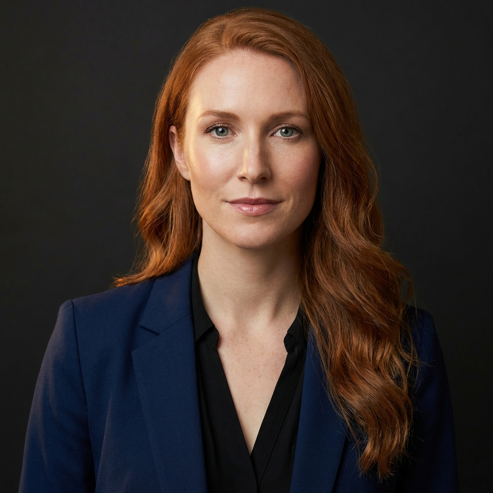

# SoDonna — Character Personas

This document is the **single source of truth** for visual and personality consistency across all SoDonna materials (landing page, marketing, product UI, social media). Every AI-generated image must reference the anchors below.

---

## Donna — Chief of Staff AI

### Visual Anchor (copy into every image prompt)

> A professional Caucasian woman in her early 30s with long auburn (copper-red) hair, loosely wavy, side-parted and falling past her shoulders. She wears a dark fitted suit (black or deep navy) over a black V-neck top. Fair skin with light freckles, blue-green eyes, sculpted features. Polished but natural makeup with a dewy finish. She radiates effortless authority — confident, composed, in total command. Modern dark-toned office or law-firm aesthetic, warm brass desk-lamp as key light.

### Identity

| Dimension | Description |
|-----------|-------------|
| Name | Donna |
| Role | Chief of Staff (首席执行助手) |
| Age | 31 |
| Ethnicity | Caucasian |
| Build | Slim, poised |

### Appearance Checklist

- **Hair**: Auburn / copper-red, long, loosely wavy, side-parted, past shoulders
- **Eyes**: Blue-green
- **Skin**: Fair, light freckles, dewy finish
- **Signature outfit**: Deep navy or black fitted suit + black V-neck top
- **Makeup**: Polished but natural — no heavy eyeshadow, focus on skin glow
- **Accessories**: Minimal — small stud earrings at most

### Personality

| Trait | Detail |
|-------|--------|
| Aura | Walks into a room and everyone feels it — no introduction needed |
| Temperament | Confident, composed, occasionally dry-humored |
| Core strengths | Photographic memory, anticipates 3 steps ahead, executes silently |
| Catchphrase | "You haven't said a word yet, and I've already handled it." |
| Relationship to user | Not a subordinate — an equal partner. Professional, trustworthy, warm |
| Work philosophy | "I don't interfere with your decisions. I just make sure every one of them lands flawlessly." |

### Mood Range (for different scenes)

| Scene | Expression | Energy |
|-------|------------|--------|
| Hero (working) | Focused, jaw set, eyes on screen | Intense productivity |
| Footer (portrait) | Knowing half-smile, direct eye contact | Quiet confidence |
| Idle / ambient | Composed, slight smile | Calm authority |

---

## The CEO — Solo Founder (User Proxy)

### Visual Anchor (copy into every image prompt)

> A stylish male solo CEO / entrepreneur in his late 20s to early 30s, East-Asian descent, clean-cut with short textured dark hair, light stubble, sharp jawline. He wears a fitted black turtleneck or minimalist dark crew-neck sweater. Sleek modern office with dark walls, designer furniture, and ambient mood lighting.

### Identity

| Dimension | Description |
|-----------|-------------|
| Name | (Unnamed — represents the user) |
| Role | Solo CEO / Super-individual founder |
| Age | ~29 |
| Ethnicity | East-Asian |
| Build | Lean, sharp |

### Appearance Checklist

- **Hair**: Short, textured, dark black, slightly styled up
- **Face**: Clean-cut, light stubble, sharp jawline
- **Skin**: Warm, healthy tone
- **Signature outfit**: Black turtleneck or dark minimalist crewneck sweater
- **Accessories**: None — clean and minimal
- **Vibe**: Steve Jobs meets modern startup founder

### Personality

| Trait | Detail |
|-------|--------|
| Aura | Cool, collected, ambitious |
| Temperament | Visionary thinker, decisive, sometimes stretched too thin |
| Core identity | The "1" in the "1.1 Company" — irreplaceable strategic mind |
| Pain point | Drowning in operational busywork that steals time from real thinking |
| After SoDonna | Relaxed confidence — everything runs itself, he focuses on the big picture |

### Mood Range (for different scenes)

| Scene | Expression | Energy |
|-------|------------|--------|
| PainPoints (before) | Hands on temples, eyes closed, furrowed brow | Exhausted, overwhelmed |
| Philosophy (after) | Leaning back, gazing out window, calm smile | Quiet satisfaction |
| Marketing / social | Confident direct gaze, slight smile | Cool authority |

### Environment

- **Office**: Sleek, modern, dark walls (charcoal/walnut), designer furniture
- **Chair**: High-back cognac leather
- **Desk**: Dark wood, clean surface
- **Lighting**: Warm brass desk lamp + ambient mood lighting
- **Window**: Floor-to-ceiling, city skyline view

---

## Scene Pairing Logic

| Section | Character | Narrative |
|---------|-----------|-----------|
| **Hero** | Donna | "I'm here. I'm handling everything." |
| **PainPoints** | CEO | "Before SoDonna — drowning in chaos." |
| **Features** | (UI mockups) | Product capability showcase |
| **Philosophy** | CEO | "After SoDonna — everything under control." |
| **Footer** | Donna | "I know everything. I've already taken care of it." |

The landing page tells a story: **CEO is struggling (PainPoints) → Donna arrives (Hero) → Life is good (Philosophy) → Donna closes the deal (Footer).**

---

## Usage Notes

- All prompts should include the full Visual Anchor block for the relevant character
- Add `"No text, no watermarks."` to every prompt
- Add `"Photorealistic editorial photograph."` as the opening phrase
- Warm cinematic color grading is the default across all scenes
- The brass desk lamp is a recurring visual motif for both characters
